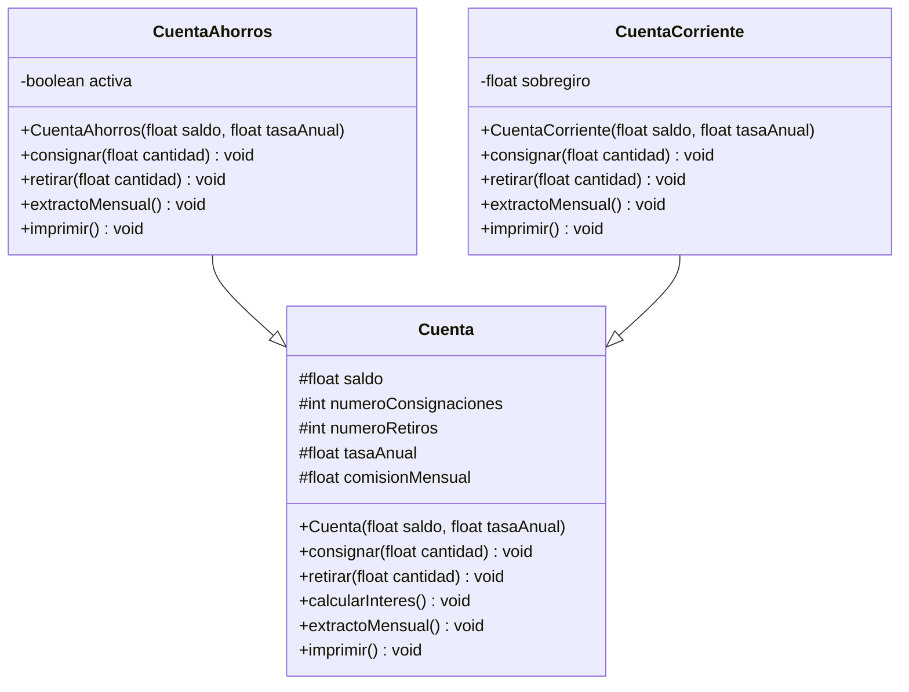

# Taller Herencia - Ejercicio 1

Implementación en Java con Maven del ejercicio de cuentas bancarias usando herencia.

## Estructura del proyecto

- `Cuenta`: clase base con operaciones comunes para manejo de saldo, consignaciones, retiros, interés y extracto mensual.
- `CuentaAhorros`: hereda de `Cuenta` y controla el estado activo/inactivo según el saldo.
- `CuentaCorriente`: hereda de `Cuenta` y permite manejo de sobregiro.
- `App`: clase principal con un ejemplo de uso.

## Diagrama de clases



## Requisitos

- Java 17 o superior.
- Maven 3.9 o superior.

## Compilación y ejecución

```bash
mvn package
java -cp target/taller-herencia-1.0-SNAPSHOT.jar com.taller.herencia.App
```
